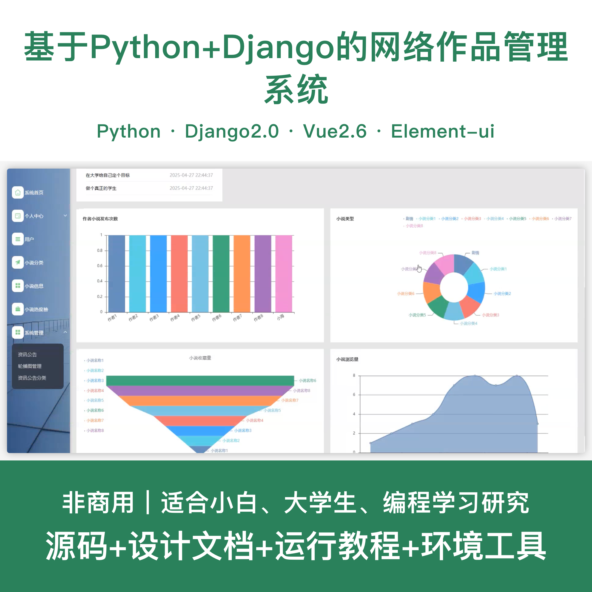
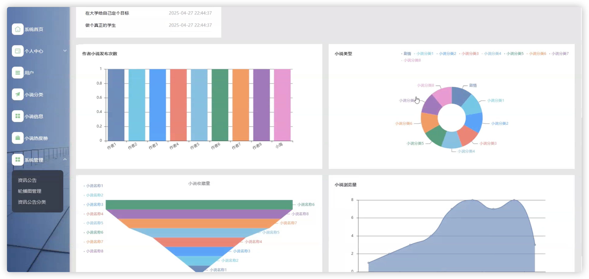
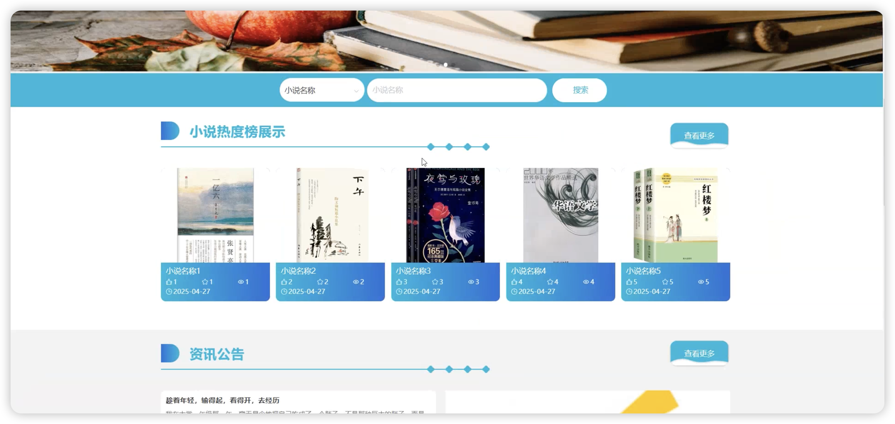
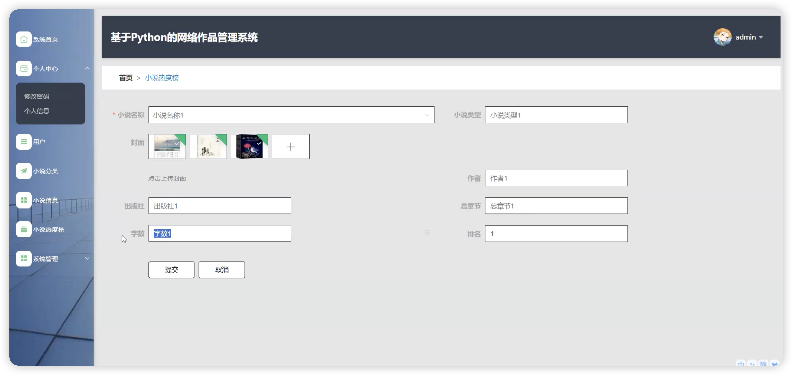
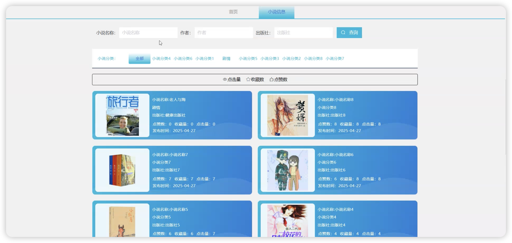
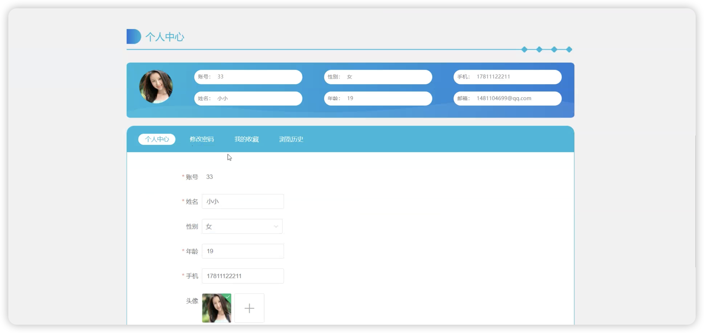
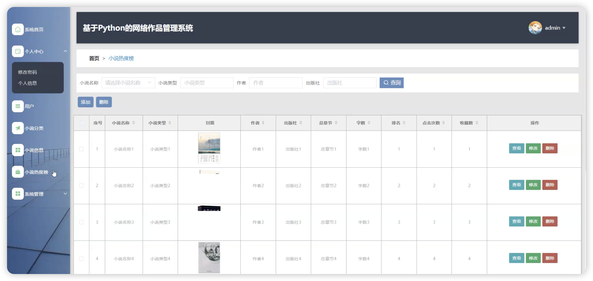
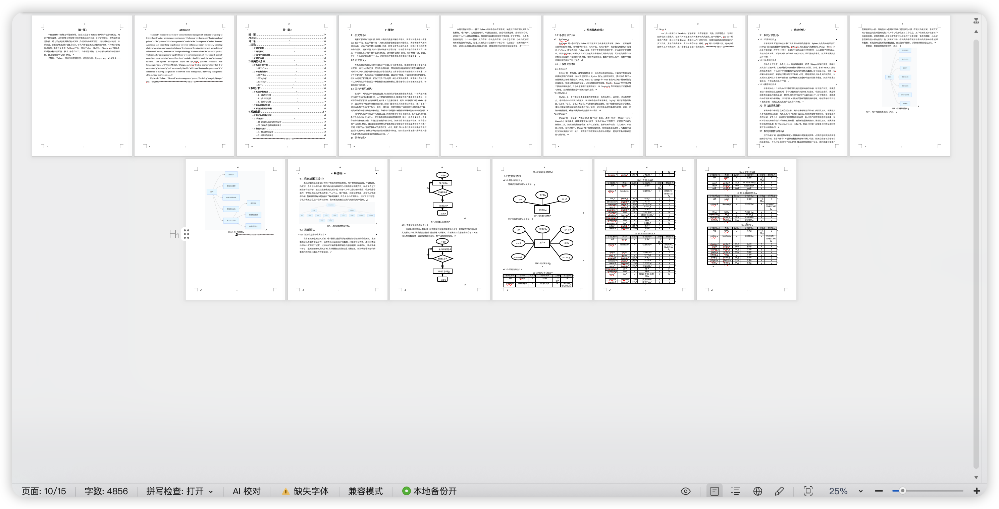

# python109D
python109D基于Python+Django的网络作品管理系统+LW
 
## 源码问题查看主页咨询

### 一、关键词
小说系统、网文系统、阅读系统、书城系统、文学作品系统

### 二、作品包含
源码+数据库+设计文档+全套环境和工具资源+本地部署教程

### 三、项目技术
前端技术：Html、Css、Js、Vue2.6、Element-ui

后端技术：Python、Django2.0、PyMySQL

### 四、运行环境（以下版本亲测，其他版本兼容性请自行测试）
开发工具：PyCharm + VSCODE

数据库：MySQL 5.7+

数据库管理工具：Navicat10以上版本

环境配置软件：Python3.7+ + pip

前端Nodejs：14+

浏览器：谷歌浏览器

### 五、项目介绍
项目编号：python109D

基于Python+Django的网络作品管理系统，方便用户随时随地浏览和管理文学作品，提升系统运营质量。

角色：管理员、用户

用户功能：注册登录、作品浏览、作品搜索、作品详情、章节阅读、作品收藏、作品评论、个人中心。

管理员功能：登录、用户管理、作品分类管理、作品信息管理、章节管理、评论管理、阅读榜单管理、系统公告管理。

数据库表数量：12张表。

### 六、运行截图

